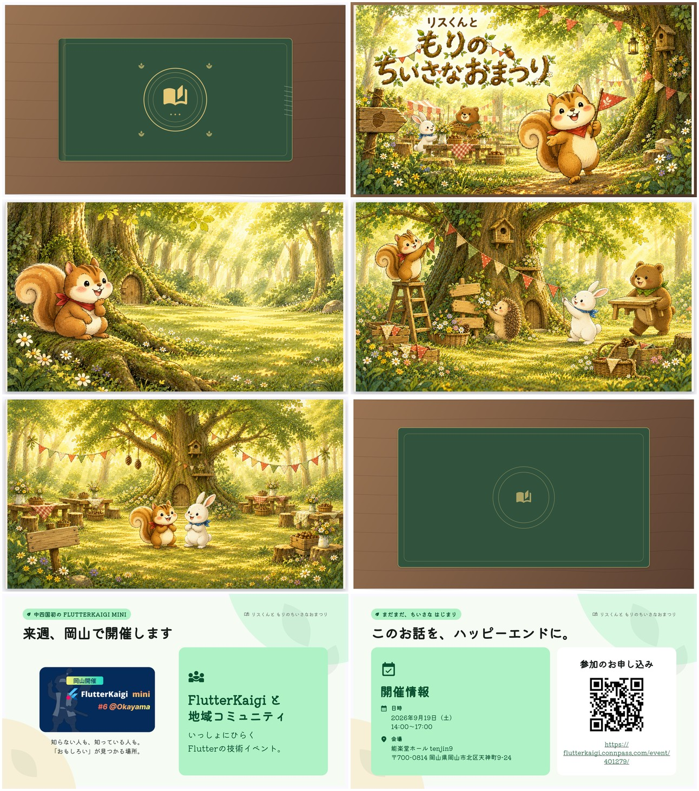

# リスくんと もりのちいさなおまつり

『リスくんと ひとつのどんぐり』の続編です。リスくんが思いついた小さなおまつりを、うさぎさん・くまさん・はりねずみさんと準備していく8枚のFlutterDeckです。絵本はタイトル表紙と本文3ページに縮小し、外側の前後カバーを含めてページめくりで見せます。その後にイベント案内と参加案内を通常のスライド遷移で表示します。

タイトル表紙と本文3枚は、画像全体を表示する構成です。ネイティブなcaption、白い帯、本文文字は重ねません。説明2枚は前作osoと同じOsoMaterialSlide、OsoBackdrop、OsoStatementCardを使い、前作テーマのフォント倍率2.2も引き継いでいます。

## スライドの順序と画面表示

外側の前カバー、タイトル表紙、本文3枚、後ろカバー、イベント案内、参加案内の順です。

| No. | キー | 画面表示・内容 |
| ---: | --- | --- |
| 1 | `frontCover` | 前作と同じ深緑・金色のアイコン装飾だけを表示する外側の前カバー。タイトル文字は表示しません。 |
| 2 | `title` | `assets/story/01_cover.png` を画像全体で表示。右手前のリスくんが旗で迎え、左奥にうさぎさん・くまさんがいる新構図で、枝葉装飾と3行のタイトル文字を画像内に含みます。 |
| 3 | `idea` | `assets/story/02_idea.png` の画像のみ。画面文字、caption、白い帯はありません。 |
| 4 | `preparation` | `assets/story/05_preparation.png` の画像のみ。画面文字、caption、白い帯はありません。 |
| 5 | `ready` | `assets/story/06_ready.png` の画像のみ。準備を終えて参加者を待つ場面です。画面文字、caption、白い帯はありません。 |
| 6 | `backCover` | 絵本の後ろカバー。本文テキストは画面に載せません。 |
| 7 | `event` | eyebrowは「中四国初の FLUTTERKAIGI MINI」、タイトルは「来週、岡山で開催します」。必須バナー、説明文「知らない人も、知っている人も。／『おもしろい』が見つかる場所。」、カード「FlutterKaigi と 地域コミュニティ／いっしょにひらく Flutterの技術イベント。」を表示します。 |
| 8 | `invitation` | eyebrowは「まだまだ、ちいさな はじまり」、タイトルは「このお話を、ハッピーエンドに。」。左側にconnpassの開催情報（2026年9月19日（土）14:00〜17:00、能楽堂ホール tenjin9、〒700-0814 岡山県岡山市北区天神町9-24）、右側に生成QR、見出し「参加のお申し込み」、クリック可能なイベントURLを表示します。 |

## スピーカーノート

`lib/speaker_notes.dart` の更新済み原文を8枚分そのまま使います。前作のどんぐりから続く物語を、思いつき、仲間との準備、参加者を待つ場面の3ページで読み聞かせます。readyは「あとは、みんなが 来てくれたら。」から「でも、お話は まだ とちゅう。」で結び、後ろカバーの「この お話の つづきは、みんなが 集まってから。」で現実の参加案内へつなぎます。おまつり当日に集まる場面は入れず、開催前のお話として扱います。

eventのノートでは「実は、私たちも岡山で、みんなの『おもしろい』が集まる場所を準備しています。」と現実へつなぎ、FlutterKaigi miniが来週岡山で開かれること、中四国初のminiイベントであること、Flutterを知らない人にも「おもしろい」が見つかる場であることを案内します。invitationでは、参加を呼びかけ、お友だちも誘い、開催日時と会場を補足して、みんなで小さなきっかけを育てることを伝えます。両方のノートに次の案内先を置いています。

https://flutterkaigi.connpass.com/event/401279/

## 起動

リポジトリのルートで依存関係を取得し、Melosの選択画面でこのパッケージを選びます。

```sh
dart pub get
dart run melos run dev
```

選択後はChromeで slides/20260912_oso_festival が起動します。Web成果物を確認するときは、ルートで次を実行します。

```sh
dart run tool/build_web.dart
```

## QRコードとイベントバナー

イベントバナーは添付された公式画像（660x371）を `assets/event/banner.png` として配置します。このファイルだけを `pubspec.yaml` に必須アセットとして登録し、EventPageで `Image.asset` と `BoxFit.contain` を使って表示します。差し替える場合も同じファイル名とパスを保ちます。

QR画像ファイルは配置しません。`lib/pages.dart` の `eventUrl` をもとに、`lib/widgets.dart` のEventQrCardがqr_flutterの `QrImageView(data: eventUrl)` で毎回生成します。表示中のURLはurl_launcherの `Link` でクリックできます。`qr.png`、`OptionalEventImage`、バナーのフォールバックは使いません。

バナーを追加・差し替えた後は、リポジトリのルートで `dart pub get` と再ビルド（開発中は再起動）を行います。

## 参照原画と新規構図

前作の原画は [前作の絵本素材](../20260912_oso/assets/risukun_hitotsu_no_donguri/) をキャラクター、画風、森のアンカーとして参照しています。`assets/story/` の7点はすべて前作原画をアンカーにした新しい構図で、前作画像の無加工流用はありません。短縮版では4点を使用し、省いた場面の3点も元画像と由来の記録を保持しています。

| 新デッキの画像 | 参照・扱い |
| --- | --- |
| `assets/story/01_cover.png` | 前作の表紙原画をアンカーにした新規表紙。右手前のリスくんが旗で迎え、左奥にうさぎさん・くまさん、左上に枝葉装飾を置き、3行タイトルを画像内に含みます。タイトル表紙titleで使用し、外側前カバーには使用しません。 |
| `assets/story/02_idea.png` | 前作 `06_page06.png` をアンカーにした新規構図。木の根に座ったリスくんが空き広場を横向きに眺めます。本文ideaで使用します。 |
| `assets/story/03_alone.png` | 前回追加した続編用の新規画像。ひとりで旗や準備を進める場面です。短縮版では未使用ですが、元画像を保持しています。 |
| `assets/story/04_friends.png` | 前作 `07_page07.png` のうさぎ原画などをアンカーにした新規構図。右手前のリスくんへ左奥から3匹がやってくる対角構図です。短縮版では未使用ですが、元画像を保持しています。 |
| `assets/story/05_preparation.png` | 前回追加した続編用の新規画像。仲間と準備する場面です。 |
| `assets/story/06_ready.png` | 前回追加した続編用の新規画像。準備が整った場面です。 |
| `assets/story/07_gathering.png` | 前作 `08_page08.png` などをアンカーにした新規構図。机を囲んで楽しむ大団円の近景です。短縮版では未使用ですが、元画像を保持しています。 |

## 差分方針

- 前作 [slides/20260912_oso](../20260912_oso/) のコード、画像、設定は変更しません。
- ページめくり、紙面リビール、前後カバーの開閉、効果音は共通パッケージ `flutter_deck_storybook` の演出を同じ方針で使います。
- 説明2枚は前作osoの `theme.dart`、OsoMaterialSlide、OsoBackdrop、OsoStatementCardと、フォント倍率2.2を同等に採用します。
- 構成は8枚（前カバー + タイトル表紙 + 本文3枚 + 後ろカバー + `event` + `invitation`）です。

connpassのイベント掲載情報から、開催日時を2026年9月19日（土）14:00〜17:00、会場を能楽堂ホール tenjin9（〒700-0814 岡山県岡山市北区天神町9-24）として表示しています。発表時点の文脈に合わせて、画面の時期表現は「来週、岡山で開催します」にしています。案内先は [FlutterKaigi mini 岡山のページ](https://flutterkaigi.connpass.com/event/401279/) です。

### 画風の固定基準

最優先のアンカーは [cover_master.png](../2026_oso_risukun_hitotsu_no_donguri/generation/refs/cover_master.png) と [page01_master.png](../2026_oso_risukun_hitotsu_no_donguri/generation/refs/page01_master.png) です。前者でリスくんの顔・体型・黒い目・巻いたしっぽ・赤いバンダナと森の色を固定し、後者でうさぎさんの顔と青いバンダナを固定しています。共同作業と完成場面は前作 `08_page08.png` の広場・くまさん・はりねずみさんを補助参照にしました。

内蔵image_genに渡したプロンプトと参照順は [refs/image_prompts.json](refs/image_prompts.json)、採用画像の由来とSHA-256は [refs/asset_manifest.json](refs/asset_manifest.json) に保存しています。参照原画は元の場所に残し、重複したrefs画像は追加していません。

表示は1920x1080の16:9、文字は前作同梱のKiwi Maruです。titleの表紙画像にはタイトルの3行文字を含め、タイトル表紙と本文3枚にはネイティブな文字を重ねません。イベントと参加案内の画面テキスト、レイアウトは `lib/pages.dart` と `lib/widgets.dart` で編集できます。

## 確認用プレビュー



## 主なファイル

- ルート `pubspec.yaml`: 新デッキをworkspaceへ登録
- ルート `README.md`: 新デッキへの入口
- このディレクトリの `pubspec.yaml` / `analysis_options.yaml` / `web/index.html`: アプリ定義
- `lib/main.dart`: 8枚の並びと共通演出
- `lib/pages.dart`: 本文の画像、案内URL、ページ設定
- `lib/speaker_notes.dart`: 全8枚の読み上げ草案
- `lib/widgets.dart`: 画像のみの本文、説明2枚、QR/バナー領域
- `lib/theme.dart`: 前作oso相当のテーマ、OsoMaterialSlide、OsoBackdrop、フォント倍率2.2
- `lib/cover_emblem.dart`: 前作由来の外側カバー用アイコン装飾
- `assets/story/`: 前作原画をアンカーにした新規構図7点（短縮版で4点を使用、3点は未使用のまま保持。無加工流用なし）
- `assets/event/banner.png`: 必須の公式イベントバナー（660x371）
- `assets/event/README.md`: QR生成とバナーの配置手順
- `assets/fonts/`: 前作から引き継いだKiwi Maru 2種
- `refs/image_prompts.json` / `asset_manifest.json` / `slide_preview.jpg`: 参照記録と確認用画像
- `test/deck_test.dart`: 全ページ移動と画像差し込みの確認
- `README.md`: 構成と運用方法
