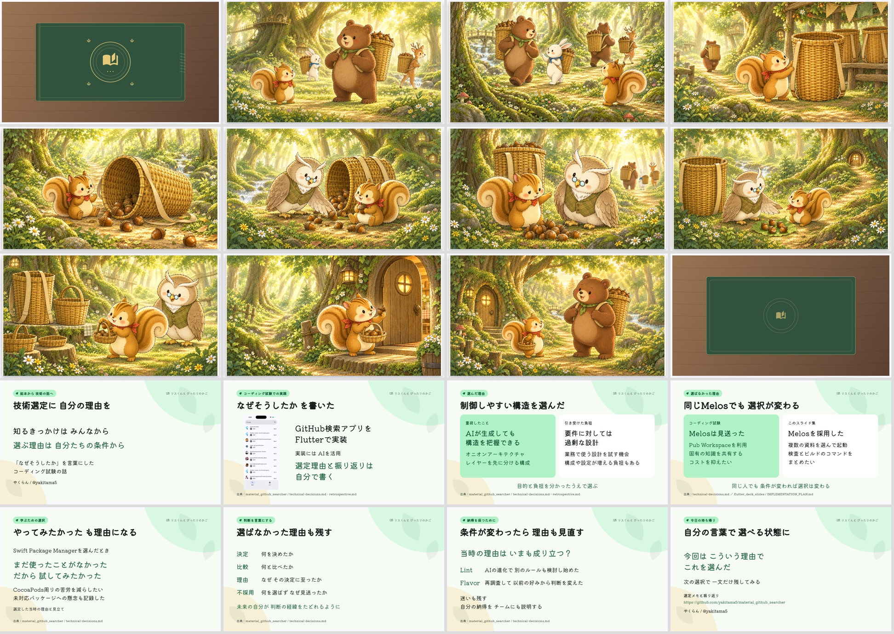

# リスくんと ぴったりのかご

「技術選定に 自分の理由を」を伝える、約10分の絵本LTです。
既存のOSO本編と懇親会LTを踏襲し、絵本を読んでから、コーディング試験の実体験を解説します。

- [スライドを開く](https://yakitama5.github.io/flutter_deck_slides/202609_technologychoice/)
- [読み上げ原稿と時間配分](SCRIPT.md)
- [画像生成プロンプトと参照元](refs/image_prompts.json)
- [画像の配置と出典](refs/asset_manifest.json)



## 構成

全20枚。表紙・絵本10場面・裏表紙で3分45秒、解説8枚で6分15秒です。
スピーカーノートの時刻にはページめくりの時間も含みます。実際の発表時間は読み方で前後するため、
原稿の時刻を目安にリハーサルしてください。自動送りは行いません。

| 時間 | 内容 |
| --- | --- |
| 00:00–03:45 | 流行の大きな背負いかごをまねしたリスくんが、自分の目的を考えて、ぴったりのかごを選ぶ |
| 03:45–04:50 | 絵本と技術選定のつながり、コーディング試験で理由を言葉にした経験 |
| 04:50–05:45 | オニオンアーキテクチャを選んだ目的と、過剰な設計だったという振り返り |
| 05:45–06:40 | 試験では見送ったMelosを、スライド集では採用した条件の違い |
| 06:40–07:20 | 学ぶためにSwift Package Managerを試した理由 |
| 07:20–09:05 | 採らなかった選択肢も記録し、条件が変わったら理由を見直す |
| 09:05–10:00 | 次の選択で「今回はこういう理由で選んだ」を一文残す |

絵本はご提示の10場面を同じ順番で収録しています。本文画像には文字を載せず、読み聞かせは
発表者ビューの原稿で行います。くまさんには大きなかごが役立ち、リスくんには小さなかごが役立つ
描写を結末にも入れ、道具の大小だけで善し悪しが決まる話にはしていません。

## OSOから引き継いだデザイン

深緑 `#31533E` と金色 `#E7C978` の表紙、Kiwi Maru、1920×1080の固定キャンバス、
解説側の淡い葉の背景とMaterialの配色を引き継いでいます。
`theme.dart` と `cover_emblem.dart` は既存の `20260912_oso_festival` を基にした独立したコピーです。
開閉・ページめくり・水彩の描画・音は共有の `flutter_deck_storybook` を使います。

画像は内蔵image_genで10枚を生成し、`assets/story/` に保存しました。
『リスくんと ひとつのどんぐり』の画像で主人公と画風を固定し、
フクロウ博士は『スーパーてんこもりカー』の姿を参照しています。
生成画像は物語の挿絵です。解説の検索画面は試験リポジトリの実スクリーンショットです。

## 原稿の根拠

コーディング試験の参照リビジョン：`5480cbe8bea6e7adce9d12bd207c2c52895d132a`

- [ご本人が書いた技術選定メモ](https://github.com/yakitama5/material_github_searcher/blob/5480cbe8bea6e7adce9d12bd207c2c52895d132a/docs/technical-decisions.md)
- [ご本人が書いた振り返り](https://github.com/yakitama5/material_github_searcher/blob/5480cbe8bea6e7adce9d12bd207c2c52895d132a/docs/retrospective.md)
- [検索アプリのREADME](https://github.com/yakitama5/material_github_searcher/blob/5480cbe8bea6e7adce9d12bd207c2c52895d132a/README.md)
- [スライド集の設計とMelosの用途](https://github.com/yakitama5/flutter_deck_slides/blob/52ad7f5/docs/IMPLEMENTATION_PLAN.md)

解説原稿は上記をもとにした発表用の草案です。選定した当時の見立てと、LTで提案する行動は
ノートで区別しています。参照した本人のメモや振り返りは編集していません。

## 起動と原稿の編集

リポジトリルートで実行します。

```sh
mise install
dart pub get
dart run melos exec --scope=technologychoice_202609 -- flutter run -d chrome
```

右矢印で進み、左矢印で戻ります。発表者ビューは画面下のツールバーから開けます。
音を止める場合は、ブラウザ側でタブをミュートしてください。

- `lib/speaker_notes.dart`：読み上げ原稿
- `lib/pages.dart`：表示順・時間配分・画像の参照先
- `lib/widgets.dart`：解説スライドの文面とレイアウト
- `lib/sources.dart`：参照資料の固定URL

ノートの累積時刻は表示順から計算します。`SCRIPT.md` は初版の読み合わせ用書き出しです。
原稿や時間を変更した場合は、こちらも更新してください。
